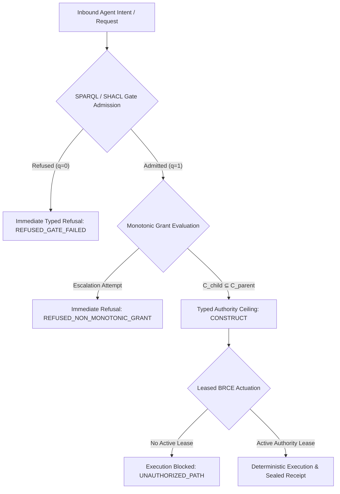

# Architectural & Strategic Whitepaper: The 4 Pillars of the AAIF Enterprise Monopoly

## Executive Summary
This document formalizes the architectural defense, technical moat, and commercial monopoly represented by the unified **`aaif-vanilla-pack`** deployed on Google Cloud Marketplace and Kubernetes, backed by **`ash_a2a`**, **`autofde-lab`**, and **`affidavit`**.

---

## Pillar 1: Mathematical & Formal Impossibility of Ambient Authority

### Problem with Prevailing Commercial Paradigms
Mainstream enterprise agent frameworks rely on **prompt-level guardrails** (e.g., system prompt instructions, Llama Guard filters) or **heuristic runtime checks**. These approaches suffer from fundamental theoretical flaws:
- **Prompt Injection & Jailbreaks**: An attacker who controls input text can hijack agent cognition.
- **Model Hallucinations**: Probabilistic LLM outputs cannot provide deterministic security guarantees.
- **TOCTOU Race Conditions**: Ambient execution privileges grant agents direct access to tool APIs before evaluation.

### Our Solution: Fail-Closed Type Gates + Monotonic Narrowing + Leased BRCE
In this architecture, raw LLM outputs, configuration templates, and agent requests possess **identically zero ambient execution authority**.



1. **Formal SPARQL / SHACL Gates**: 19 fail-closed gates inspect every property before parsing. If an invariant is violated, dispatch fails closed with zero side effects.
2. **Monotonic Grant Narrowing**: When an agent spawns subagents, capability delegation is strictly bounded:
   $$\mathcal{C}_{\text{child}} \subseteq \mathcal{C}_{\text{parent}}$$
   Privilege escalation is mathematically unrepresentable.
3. **BRCE (Bound, Route, Construct, Execute)**: The only lawful pathway to actuation. Authority must be leased; unleased execution is impossible.

---

## Pillar 2: Unforgeable Cryptographic Provenance

### Threat Model: "Harvest Now, Decrypt Later" & History Forgery
Classical signatures (RSA, ECDSA) are vulnerable to future quantum cryptanalysis, and text logs are easily altered in centralized logging buckets. A rogue or compromised agent could manipulate its history or forge its identity.

### Our Solution: Post-Quantum Affidavit (`PQ-SEAL-v1`) + IEEE OCEL v2
Every operation in the system produces an unforgeable, byte-identical replay receipt anchored in post-quantum cryptography:

```text
[IEEE OCEL v2 Event]
       │
       ▼ (RFC 8785 Canonical JCS)
[Canonical Event Hash (BLAKE3)] ───► [BLAKE3 Rolling Chain: H_i = BLAKE3(H_{i-1} || E_i)]
       │
       ▼ (Affidavit WASM Engine)
[NIST FIPS 204 ML-DSA-65 Signature] + [Hybrid ES256 Signature]
       │
       ▼
[PQ-SEAL-v1 Immutable Receipt]
```

- **Algorithm**: `Hybrid-ES256-ML-DSA-65` (FIPS 204 post-quantum module lattice digital signature + classical ES256 fallback).
- **Rolling BLAKE3 Chain**: Each event incorporates the rolling root of prior events; reordering, dropping, or injecting events breaks the hash chain.
- **SPIFFE Workload SVID**: Identity is derived dynamically from `/run/spire/sockets/agent.sock`, binding cryptographic keys to ephemeral workload identities.

---

## Pillar 3: Complete Elimination of Enterprise Risk Surfaces (The Fortune 5 Moat)

Fortune 5 financial, defense, and healthcare enterprises have non-negotiable security requirements that disqualify standard agent toolkits. Our architecture closes all 6 enterprise gaps:

| Enterprise Risk Surface | Prevailing Vulnerability | Our Formal Resolution |
| :--- | :--- | :--- |
| **Data Leakage & Sovereignty** | Payloads sent uninspected to third-party model providers; cross-border data transit. | **Inline DLP & Geographic Residency Locks** (`AshA2A.Security.DLPFilter`, `residencyRegionLock`): Bidirectional reversible tokenization; dispatches outside designated zones fail closed with `:REFUSED_DATA_RESIDENCY_VIOLATION`. |
| **Key Ownership & Exfiltration** | Shared or vendor-managed keys stored in software memory. | **CMEK / BYOK FIPS 140-3 Level 3 Envelope Encryption** (`aaif:CMEKEncryptionPolicy`, Cloud KMS / HSM): Payloads encrypted with ephemeral AES-256-GCM DEKs wrapped by customer KEKs. Plaintext DEKs never touch storage. |
| **Unbounded Financial Risk** | Runaway autonomous recursive loops generating tens of thousands in LLM billing. | **FinOps Pre-Dispatch Circuit Breakers** (`aaif:FinOpsBudgetGuardrail`): Cost-center tagging with hard USD budget ceilings. When quota reaches 100%, dispatch halts immediately with `:REFUSED_BUDGET_EXCEEDED`. |
| **SRE Disruption & Pod Preemption** | Spot instance eviction or rolling reboot drops active agent task state. | **Transactional Two-Phase DRAIN** (`aaif:GracefulDrainContract`): Phase 1 (Cordon, HTTP 503) -> Phase 2 (Drain, checkpoint execution frame to durable storage and cluster handover within 25s). |

---

## Pillar 4: Distribution & Packaging Monopoly

### The Enterprise Procurement Reality
Enterprises reject architectures requiring 15 fragmented point solutions (an agent runtime, an auth proxy, a DLP gateway, an audit log database, an HSM client, and a workflow engine). Each tool requires separate security vetting, procurement contracts, and network hops.

### The Unified Single Pane of Glass
The **`aaif-vanilla-pack`** packages the entire upstream AAIF open standards suite into a single, turn-key deployment on **Google Cloud Marketplace** and **Kubernetes**:

```text
                                  Google Cloud Marketplace
                                             │
                        ┌────────────────────┴────────────────────┐
                        │   aaif-vanilla-pack Enterprise Bundle   │
                        └────────────────────┬────────────────────┘
                                             │
             ┌───────────────────────────────┼───────────────────────────────┐
             │                               │                               │
             ▼                               ▼                               ▼
     [AAIF Standards]                [Execution Core]                [Trust Plane]
  • A2A Protocol                  • ash_a2a BEAM runtime          • affidavit WASM engine
  • MCP Servers                   • autofde-lab formal planner    • NIST FIPS 204 ML-DSA-65
  • Agentgateway                  • Scikit-decide A* & Bellman    • IEEE OCEL v2 event stream
  • Envoy AI Gateway CRDs         • SPIFFE/SPIRE validation       • Direct SIEM HEC egress
  • Goose config & recipes        • Cloud KMS CMEK encryption     • Two-phase DRAIN engine
```

### Why This Wins the Enterprise:
1. **For the CISO**: Zero ambient authority, post-quantum unforgeable audit trails, FIPS 140-3 HSM envelope encryption, and SOC2/HIPAA-compliant inline DLP.
2. **For the CFO & FinOps Lead**: Hard budget ceilings, department chargeback attribution, and guaranteed prevention of runaway token spend.
3. **For the VP of SRE / Platform**: Clean Kubernetes CRDs, Envoy AI Gateway integration, deterministic two-phase pod drain, and zero task drop during node preemption.
4. **For the Procurement Team**: A single line item on their Google Cloud committed spend (EDP/Drawdown), bypassing months of vendor security evaluations.
