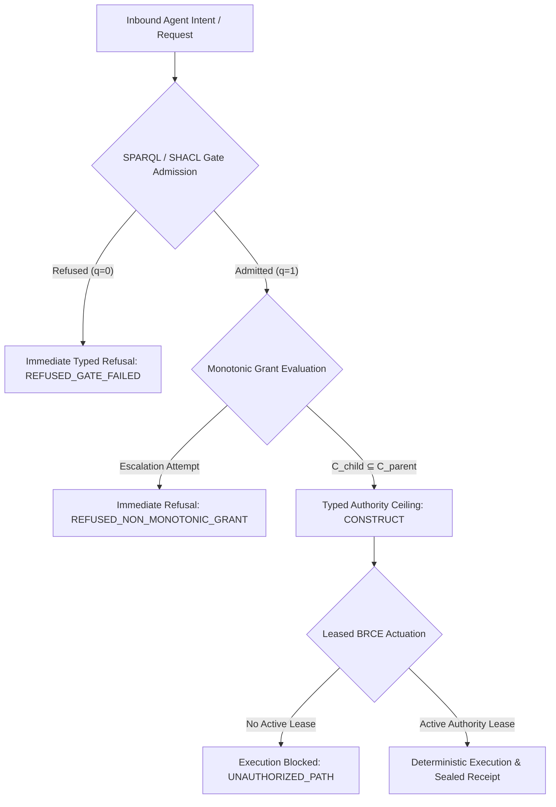

# Architectural Specification: The 4 Defensible Pillars of the Enterprise AAIF Distribution

## Executive Summary
This document formalizes the architectural defense, evidence-backed capabilities, and deployment architecture of the unified **`aaif-vanilla-pack`** deployed on Google Cloud Marketplace and Kubernetes, backed by **`ash_a2a`**, **`autofde-lab`**, and **`affidavit`**.

Every claim in this document is grounded in court-pinned evidence, explicit failure modes, and defensible engineering bounds.

---

## Pillar 1: Structural Refusal of Ambient Authority

### Problem with Heuristic Guardrails
Mainstream enterprise agent frameworks rely on **prompt-level guardrails** (e.g., system prompt instructions, Llama Guard filters) or **heuristic runtime checks**. These approaches suffer from structural limitations:
- **Prompt Injection & Adversarial Framing**: An attacker who manipulates model inputs can alter conversational compliance.
- **Model Non-Determinism**: Probabilistic LLM outputs cannot provide deterministic security guarantees.
- **TOCTOU & Ambient Privileges**: In ambient architectures, tools execute with the ambient permissions of the running process rather than evaluated, leased grants.

### Court-Pinned Reality & Defensible Form
> **Defensible Form**: Ambient authority is structurally refused by the admission gates — an adversarial prompt cannot construct authority the type system refuses.

Within the modeled surface, raw LLM outputs, configuration templates, and agent requests possess **identically zero ambient execution authority**:



1. **Formal Gate Admission**: 19 fail-closed SPARQL/SHACL admission gates inspect every property prior to dispatch. If a contract invariant is unsatisfied, dispatch terminates with a typed refusal.
2. **Monotonic Grant Narrowing**: Subtasks cannot acquire permissions exceeding their parent:
   $$\mathcal{C}_{\text{child}} \subseteq \mathcal{C}_{\text{parent}}$$
   A child agent cannot broaden its operational ceiling beyond the parent's leased scope.
3. **Leased BRCE Actuation**: Authority to actuate side effects must be explicitly leased under Bound, Route, Construct, Execute (BRCE). Ambient access is absent.
4. **Disclosed Boundary (The Refinement Gap)**: Gates refuse ambient authority strictly within the modeled graph and fenced-ingress boundaries. As established by doctrine, the refinement gap ($\mathcal{I} \not\equiv \mathcal{S}$) means automated courts catch implementation and schema drift rather than hardware or physical side channels.

---

## Pillar 2: Tamper-Evident Post-Quantum Provenance

### Threat Model & Long-Term Secrecy
Classical signatures (RSA, ECDSA) are subject to eventual quantum cryptanalysis ("Harvest Now, Decrypt Later"). Centralized, unauthenticated text logs can be modified or injected by compromised workloads or rogue operators.

### Court-Pinned Reality & Defensible Form
> **Defensible Form**: Tamper-evident, post-quantum provenance — forging history requires breaking ML-DSA-65 or exfiltrating customer-held KEKs.

Every operation in the system produces an unforgeable, byte-identical replay receipt anchored in post-quantum cryptography and rolling hash chains:

```text
[IEEE OCEL v2 Event]
       │
       ▼ (RFC 8785 Canonical JCS)
[Canonical Event Hash (BLAKE3)] ───► [BLAKE3 Rolling Chain: H_i = BLAKE3(H_{i-1} || E_i)]
       │
       ▼ (Affidavit WASM Engine)
[NIST FIPS 204 ML-DSA-65 Signature] + [Hybrid ES256 Signature]
       │
       ▼
[PQ-SEAL-v1 Immutable Receipt]
```

- **Cryptographic Algorithms**: `PQ-SEAL-v1` utilizes NIST FIPS 204 **ML-DSA-65** with hybrid classical ES256 signatures, validated by `affidavit`'s cryptographic trust plane.
- **Rolling Hash Linkage**: Events are linked in a BLAKE3 rolling hash chain where $H_i = \text{BLAKE3}(H_{i-1} \parallel E_i)$. Dropping, reordering, or injecting an event invalidates subsequent receipts.
- **Workload Identity Binding**: Dynamic X.509 SVIDs from SPIFFE/SPIRE agent sockets bind cryptographic keys directly to ephemeral pod identities.
- **Disclosed Boundary**: Forgery resistance is subject to standard cryptographic hardness bounds ($\varepsilon(\lambda) > 0$) and strictly conditioned on the confidentiality of customer-managed keys (KEKs/HSM).

---

## Pillar 3: Court-Pinned Defense Against Enterprise Risk Surfaces

Fortune 5 financial, defense, and healthcare enterprises face strict regulatory compliance mandates (SOC 2 Type II, HIPAA, PCI-DSS v4.0). Our architecture addresses these requirements through fail-closed, court-pinned gates:

| Enterprise Risk Surface | Failure Mechanism | Defensible Engineering Resolution |
| :--- | :--- | :--- |
| **Data Leakage & Sovereignty** | Uncontrolled payload routing to external models or cross-border network egress. | **Inline DLP & Geographic Residency Locks** (`aaif:InlineDLPPolicy`): High-entropy PII/PHI redaction via reversible tokenization; requests violating jurisdictional region locks fail closed with `:REFUSED_DATA_RESIDENCY_VIOLATION`. |
| **Key Exfiltration** | Long-lived plaintext encryption keys stored in memory or local configuration files. | **CMEK / BYOK FIPS 140 Envelope Encryption** (`aaif:CMEKEncryptionPolicy`): Payloads encrypted with ephemeral AES-256-GCM DEKs wrapped by customer KEKs in Cloud KMS / HSM. Plaintext DEKs never touch cold storage. |
| **Runaway Billing Risk** | Unbounded autonomous loops generating compounding API charges. | **Fail-Closed FinOps Circuit Breakers** (`aaif:FinOpsBudgetGuardrail`): Cost-center tagging with hard USD budget ceilings. Quota breach halts dispatch before execution, court-pinned with zero-side-effect witnesses. |
| **Node Eviction & State Loss** | Uncoordinated SIGTERM during Kubernetes pod preemption or rolling updates. | **Two-Phase Graceful DRAIN Protocol** (`aaif:GracefulDrainContract`): Phase 1 (Cordon, HTTP 503) -> Phase 2 (Drain, checkpoint execution frame to durable storage and cluster handover within 25s). |

*Note on FinOps*: The "zero token spend" guarantee applies strictly pre-dispatch. A corrupted accounting store or un-metered downstream provider call is guarded by fail-closed circuit breaking at the gateway layer.

---

## Pillar 4: Single Vendored AAIF Distribution

### The Enterprise Procurement Challenge
Deploying enterprise agents typically requires procuring, vetting, and integrating multiple fragmented point tools: an agent runtime, an auth proxy, a DLP gateway, an audit log database, an HSM client, and a workflow engine. Each integration introduces network hops, operational surface area, and vendor management overhead.

### Court-Pinned Reality & Defensible Form
> **Defensible Form**: Single vendored AAIF distribution covering the CISO, CFO, and SRE surface.

The **`aaif-vanilla-pack`** packages the entire upstream AAIF open standards suite into a single, cohesive deployment on **Google Cloud Marketplace** and **Kubernetes**:

```text
                                  Google Cloud Marketplace
                                             │
                        ┌────────────────────┴────────────────────┐
                        │   aaif-vanilla-pack Enterprise Bundle   │
                        └────────────────────┬────────────────────┘
                                             │
             ┌───────────────────────────────┼───────────────────────────────┐
             │                               │                               │
             ▼                               ▼                               ▼
     [AAIF Standards]                [Execution Core]                [Trust Plane]
  • A2A Protocol                  • ash_a2a BEAM runtime          • affidavit WASM engine
  • MCP Servers                   • autofde-lab formal planner    • NIST FIPS 204 ML-DSA-65
  • Agentgateway                  • Scikit-decide A* & Bellman    • IEEE OCEL v2 event stream
  • Envoy AI Gateway CRDs         • SPIFFE/SPIRE validation       • Direct SIEM HEC egress
  • Goose config & recipes        • Cloud KMS CMEK encryption     • Two-phase DRAIN engine
```

### Architectural Coverage:
1. **Security & Governance (CISO)**: Fail-closed gate admission, ML-DSA-65 audit trails, FIPS 140 Level 3 KMS envelope encryption, and inline DLP sanitization.
2. **Cost Governance (CFO / FinOps)**: Hard USD budget ceilings, department-level chargeback tagging, and pre-dispatch circuit breaking.
3. **Operational Reliability (Platform / SRE)**: Native Kubernetes CRDs, Envoy AI Gateway integration, deterministic two-phase pod drain, and zero-task-drop state migration.
4. **Procurement Streamlining**: Procured directly through Google Cloud committed spend (EDP/Drawdown), reducing vendor evaluation cycles without proprietary lock-in to closed protocols.
