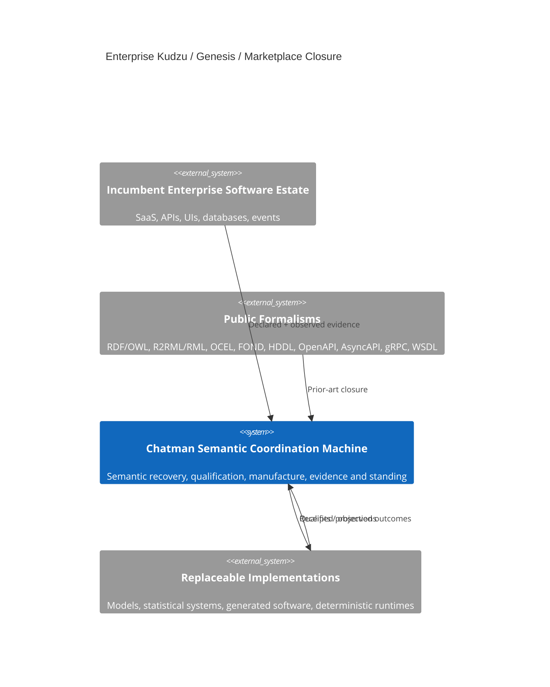
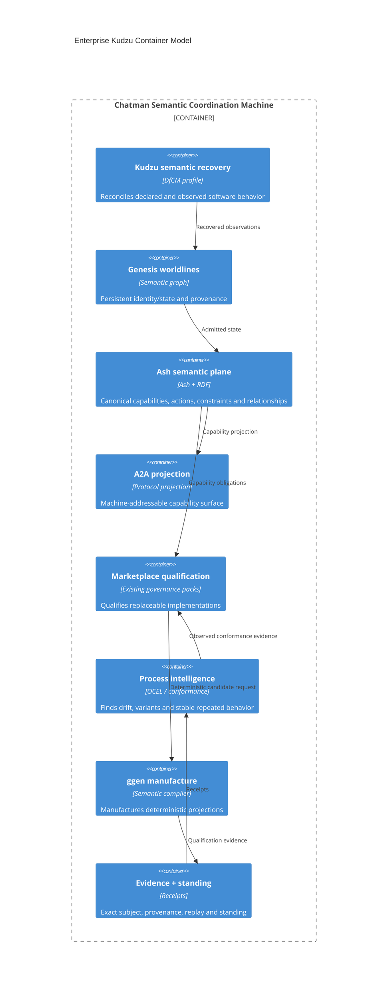
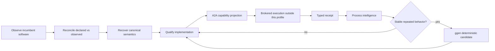

# Enterprise Kudzu v26.9.13

## Thesis

Enterprise Kudzu is a DfCM profile over the existing 12 canonical marketplace packs. It does not add a new authority pack. It recovers canonical capability semantics from incumbent software, observed process evidence, and persistent identity/worldline state, then exposes those semantics through replaceable projections.

The stable objects are meaning, evidence, standing, and authority. APIs, SaaS products, model providers, A2A agents, generated artifacts, statistical models, and deterministic implementations are projections.

`Capability != Implementation != Provider != Agent != Role != HumanTwin`

`SELECT != CONSTRUCT != DO`

Existing public standards and formal methods are searched before invention. Observed behavior is evidence, not automatic authority. Generated artifacts remain non-sovereign until independently qualified.

Human twins in this profile are persistent identity/state objects only. The marketplace does not make personnel, employment, compensation, or other human-status decisions.

## Production use cases

1. **Legacy estate absorption** — recover capability semantics from OpenAPI, AsyncAPI, GraphQL introspection, gRPC reflection, WSDL, OData, SQL metadata, event logs, traffic evidence, and accessibility/UI observations without making a vendor schema canonical.
2. **Persistent Genesis state** — attach observations, roles, credentials, relationships, obligations, authority evidence, and receipts to persistent human or system worldlines while keeping identity distinct from role and agent projections.
3. **A2A capability projection** — expose admitted Ash capability truth to machine protocols without making an A2A agent the semantic source or granting it consequence-bearing authority.
4. **Marketplace qualification** — compare software/model/statistical/deterministic implementations against the same admitted capability obligations and replay evidence.
5. **Machine Experience ratchet** — detect stable repeated software behavior, manufacture a deterministic candidate, requalify it, and preserve the capability contract while the implementation changes.

## DfCM law

The mandatory resolution order remains:

`reuse -> compose -> extend -> invent`

Novel construction is admitted only after prior-art closure and an exact residual falsifier. The public search surface includes protocol standards, ontologies, formal planning notations, process-mining formalisms, contract-testing systems, framework-native primitives, generators, and existing marketplace capabilities.

## C4 — context



## C4 — containers



## C4 — closed loop



## Genesis twin boundary

A Genesis human twin is the admitted persistent state/worldline of a person, not a simulated person and not an agent. Roles, credentials, relationships, applications and A2A surfaces are projections associated with that persistent identity.

The twin may carry provenance-rich observations such as membership, credentials, authority evidence, completed actions and receipts. This profile does not infer or actuate personnel status from those observations.

Public ontology alignment should prefer PROV-O, OWL-Time, W3C ORG, VC/DID, ODRL, SHACL, SOSA/SSN, QUDT, SKOS, R2RML/RML and OCEL before any private vocabulary is invented.

## FOND policy contract

FOND owns nondeterministic recovery for *software capability qualification*. It does not grant DO authority.

```lisp
(define (domain enterprise-kudzu-fond)
  (:requirements :strips :typing :negative-preconditions :non-deterministic)
  (:types capability implementation)
  (:predicates
    (requested ?c - capability)
    (semantics-admitted ?c - capability)
    (candidate ?i - implementation ?c - capability)
    (qualified ?i - implementation ?c - capability)
    (selected ?i - implementation ?c - capability)
    (execution-observed ?i - implementation ?c - capability)
    (conforms ?i - implementation ?c - capability)
    (drifted ?i - implementation ?c - capability)
    (stable-pattern ?c - capability)
    (deterministic-candidate ?i - implementation ?c - capability))

  (:action select-qualified
    :parameters (?i - implementation ?c - capability)
    :precondition (and (requested ?c) (semantics-admitted ?c) (qualified ?i ?c))
    :effect (selected ?i ?c))

  (:action observe-execution
    :parameters (?i - implementation ?c - capability)
    :precondition (selected ?i ?c)
    :effect (oneof
      (and (execution-observed ?i ?c) (conforms ?i ?c))
      (and (execution-observed ?i ?c) (drifted ?i ?c))))

  (:action qualify-deterministic-candidate
    :parameters (?i - implementation ?c - capability)
    :precondition (and (stable-pattern ?c) (deterministic-candidate ?i ?c))
    :effect (qualified ?i ?c)))
```

The profile deliberately omits a consequence-bearing DO action. Existing BRCE / CommandBus authority remains the only lawful actuation boundary.

## HDDL decomposition

```lisp
(define (domain enterprise-kudzu-hddl)
  (:requirements :typing :hierarchy)
  (:types source capability)

  (:task absorb-software-source :parameters (?s - source ?c - capability))
  (:task qualify-capability :parameters (?c - capability))
  (:task close-experience-loop :parameters (?c - capability))

  (:method absorb-by-dfcm
    :parameters (?s - source ?c - capability)
    :task (absorb-software-source ?s ?c)
    :ordered-subtasks (and
      (t1 (discover-public-formalisms ?s))
      (t2 (ingest-declared-contract ?s))
      (t3 (capture-observed-behavior ?s))
      (t4 (reconcile-declared-observed ?s))
      (t5 (recover-purpose-and-invariants ?s))
      (t6 (align-canonical-semantics ?s ?c))
      (t7 (verify-semantic-contract ?c))))

  (:method learn-and-determinize
    :parameters (?c - capability)
    :task (close-experience-loop ?c)
    :ordered-subtasks (and
      (t1 (collect-receipts ?c))
      (t2 (run-conformance-analysis ?c))
      (t3 (detect-stable-pattern ?c))
      (t4 (manufacture-deterministic-candidate ?c))
      (t5 (qualify-capability ?c)))))
```

## Feature census imported by DfCM

The profile should maximize prior-art reuse from the following capability families rather than reimplement them:

- GraphQL Mesh style multi-protocol ingestion and schema linking.
- APIClarity / Optic style declared-vs-observed API reconstruction and drift detection.
- Smithy / TypeSpec style protocol-independent semantic IR and many projections.
- Kiota style surface slicing and transport/auth adapters.
- Microcks / Schemathesis / Pact style mock, negative, stateful and bidirectional contract qualification.
- Nango / Airbyte / Meltano style connector lifecycle, paging, retries, cursors, webhooks and checkpoints.
- Ontop / Morph-KGC style virtual or materialized RDF/R2RML/RML semantic projection.
- gRPC reflection and AsyncAPI style runtime/event discovery.

These are prior-art capability inputs, not new top-level marketplace authorities.

## Production standing contract

This profile is structurally falsified if any of the following occurs:

1. the active marketplace topology changes from 12 canonical packs;
2. Kudzu, Genesis, A2A, process intelligence, or marketplace intelligence acquires a new top-level authority pack merely because it is a technology/profile;
3. observed behavior is silently treated as admitted authority;
4. a protocol/provider/agent identity becomes canonical capability truth;
5. deterministic replacement bypasses independent qualification;
6. semantic projection or planning gains consequence-bearing DO authority;
7. generated artifacts require hidden hand editing to satisfy the modeled path;
8. human identity is collapsed into role, agent, or software implementation semantics.

Exact-head execution evidence is required before claiming ALIVE, merge, publication, or live enterprise operation.
