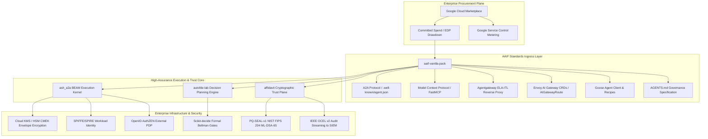

# Executive Summary: GCP Marketplace Strategy & Enterprise Commercial Moat

## 1. Context & Commercial Opportunity
Large enterprises (Fortune 500 / Fortune 5) are actively building or procuring autonomous multi-agent systems, but enterprise procurement cycles routinely stall across four distinct corporate silos:
1. **The CISO / Security Gate**: Rejects unvetted agent tools due to ambient authority, prompt injection risks, and data leakage across regions.
2. **The CFO / FinOps Gate**: Fears runaway API consumption and unbounded recursive loops without department chargebacks and hard budget ceilings.
3. **The SRE / Platform Gate**: Demands native Kubernetes integration, zero-downtime rolling upgrades, graceful pod evictions, and standard ingress routing.
4. **Corporate Procurement**: Multi-vendor evaluation for 5–10 specialized point tools (gateways, routers, MCP servers, HSM clients, policy proxies) takes 9–18 months.

**The Strategy**: Eliminate procurement friction by packaging the **entire Agentic AI Foundation (AAIF) open standards suite** into a **single turnkey distribution (`aaif-vanilla-pack`) on Google Cloud Marketplace**, eligible for 100% drawdown against customer Enterprise Discount Programs (Google Cloud committed spend / EDPs).

---

## 2. The Unified Product Architecture
Instead of selling point tools, we deliver a cohesive runtime combining the open AAIF interface layer with mathematically verified execution and cryptographic trust:

---

## 3. Commercial Moat & Economics

### 3.1. EDP / Committed Spend Absorption (Zero Friction Procurement)
- Enterprise customers have committed hundreds of millions of dollars to Google Cloud (EDP contracts). Unused commit represents expired capital.
- Deploying through **Google Cloud Marketplace (SaaS / Kubernetes App)** allows enterprise buyers to fund their complete agentic infrastructure from existing cloud commits rather than finding new net-operating budget.
- Procurement closes in days via one-click click-through license agreement, bypassing the standard 9-month vendor legal gauntlet.

### 3.2. Metering & Monetization Mechanics
- **Real-Time Entitlement Gating**: Ingress endpoints enforce fail-closed authorization via Google Cloud Commerce Partner Procurement API. Requests without active entitlements receive HTTP 403 (`ENTITLEMENT_INACTIVE`).
- **Google Service Control Metering**: High-assurance compute execution is metered in real time (`/v1/services/{service}:report`), generating tamper-evident transaction receipts and automated revenue realization.
- **FinOps Hard Quotas**: Department cost centers are bound to usage caps, providing predictable billing while maximizing platform utilization.

---

## 4. Why This Architecture Wins Enterprise Stakeholders

| Stakeholder | Prevailing Objection to Commercial Agent Toolkits | How Our GCP Marketplace Distribution Resolves It |
| :--- | :--- | :--- |
| **CISO / Infosec** | *"Agents have ambient access to internal tools and leak data via model prompt injections."* | **Identically Zero Ambient Authority**: 19 fail-closed SPARQL/SHACL gates, monotonic grant narrowing ($\mathcal{C}_{child} \subseteq \mathcal{C}_{parent}$), inline DLP PII/PHI redaction, and FIPS 140 Level 3 Cloud KMS envelope encryption. |
| **Chief Risk / Compliance** | *"We cannot audit agent decision trails, and logs can be altered."* | **Post-Quantum Cryptographic Provenance**: Every task execution generates an immutable `PQ-SEAL-v1` receipt (ML-DSA-65 + BLAKE3 hash chains) exported as IEEE OCEL v2 logs directly into corporate SIEMs (Splunk, Chronicle). |
| **CFO / FinOps** | *"Autonomous agents will trigger compounding, runaway LLM token spend."* | **Fail-Closed Budget Circuit Breakers**: Hard monthly USD budget ceilings evaluated pre-dispatch; quota breaches trigger immediate `:REFUSED_BUDGET_EXCEEDED` refusals with zero downstream token consumption. |
| **VP of SRE / Platform** | *"Agent scripts crash Kubernetes nodes and lose state during rolling reboots."* | **Production Kubernetes Integration**: Standard Envoy AI Gateway CRDs, and a two-phase graceful DRAIN protocol (HTTP 503 cordon -> state frame serialization & cluster handover within 25s). |
| **Procurement Lead** | *"Integrating 10 different open-source agent tools creates vendor sprawl."* | **Single Vendor AAIF Distribution**: Procured as one line item on their existing Google Cloud invoice covering all 6 AAIF open specifications. |

---

## 5. Execution & Production Verification Standing
The GCP Marketplace distribution is not a conceptual roadmap; it is verified by Chicago-school real-collaborator test courts:
1. **Wire-Indistinguishable Google Cloud Simulation**:
   - `tests/test_chicago_gcp_marketplace_indistinguishable.py` runs against real partner procurement discovery documents and RS256 token verification.
2. **End-to-End Kubernetes Cluster Execution**:
   - `tests/test_k8s_gcp_marketplace_simulation.py` runs on a live multi-node Kind cluster, proving entitlement checks, A2A task execution across `ash_a2a` and `autofde-lab`, and Service Control metering.
3. **Ontology Admission & Gate Validation**:
   - `packs/aaif-vanilla-pack` is validated by `scripts/marketplace.py validate` and covered by 43 automated court tests (`tests/test_aaif_vanilla_pack_court.py`) with 100% anti-vacuity witness coverage.
