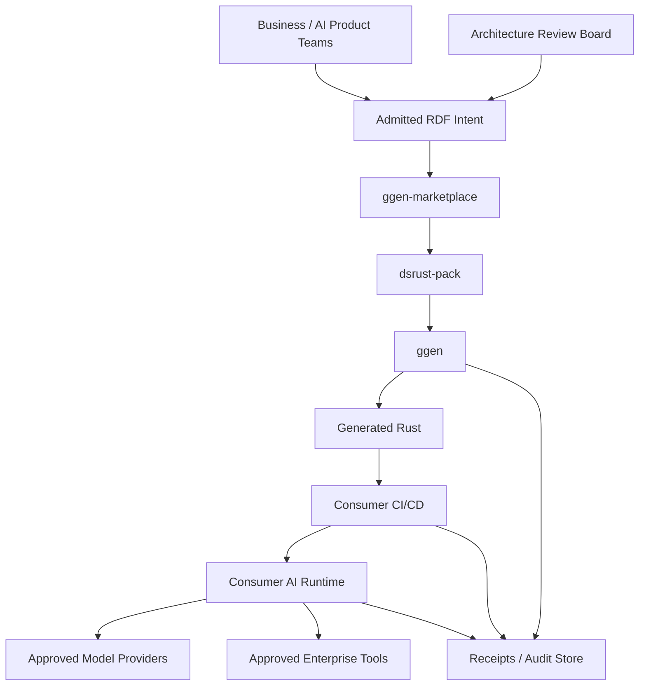

# DsRust Pack — Fortune-5 Enterprise Architecture Blueprint

## Executive architecture decision

`dsrust-pack` is a **deterministic construction-plane capability**, not a runtime AI platform. Its
enterprise value is to convert admitted RDF intent into reviewable Rust source while keeping model
credentials, datasets, tools, network access, runtime policy, and production actuation outside the
marketplace trust boundary.

This boundary is deliberate. Making the marketplace own provider credentials, tool bodies, or
production runtime controls would collapse architecture governance, code generation, and actuation
into one authority domain. The pack therefore supports an optional `dsrust:EnterpriseBinding` that
connects a generated DsRust program to an enterprise-owned architecture asset while preserving
separation of duties.

## Capability map

| Capability | System of record | Accountable plane | Evidence |
|---|---|---|---|
| DSPy-style semantic declaration | Consumer RDF | Application architecture | RDF + admission gate |
| DsRust API compatibility | `seanchatmangpt/dsrust@f24adde...` | Pack/source governance | exact commit + coverage ledger |
| Rust source manufacture | ggen | Marketplace construction plane | deterministic replay receipt |
| Rust compilation | Consumer CI | Engineering delivery | `cargo fmt/check/test/clippy` |
| LM/provider integration | Consumer runtime | Platform/security | provider IAM, egress, secrets |
| ReAct tool authority | Consumer runtime | Application/security | tool implementation + policy |
| Data governance | Consumer | Data architecture | classification, residency, retention |
| Production SLO/DR | Consumer | SRE/platform | SLI/SLO, capacity, RTO/RPO |
| Promotion | Enterprise delivery | Change authority / ARB | receipt bundle |
| Rollback | Enterprise delivery | Change authority | previous pin + receipt |

## C4 system context

## Architecture principles

1. **Exact-source law.** The supported API surface is pinned to one observed DsRust source commit.
2. **Construct before actuate.** Generation may construct code; it does not receive production DO authority.
3. **Consumer-owned runtime.** Credentials, datasets, provider selection, network controls, tool bodies,
   SLOs, regions, and incident response belong to the consuming platform.
4. **Fail closed.** Unsupported DSPy features and missing enterprise binding facts are typed refusals.
5. **Receipts over assertion.** Promotion uses deterministic marketplace receipts plus consumer CI/runtime evidence.
6. **Reversible change.** Rollback means regenerate from the previously admitted source and pack receipt,
   rather than hand-edit generated consequences.
7. **No control theater.** Static projection packages do not invent fake multi-region/KMS controls; those
   controls are applied to the runtime asset where they have operational meaning.

## NFR / control envelope

### Security

- No secrets or provider credentials belong in pack RDF or templates.
- Generated tool/reward/metric bodies are non-authoritative seams until the consumer replaces them.
- Direct runtime actuation from the pack is prohibited.
- Consumer CI must run dependency/license/vulnerability policy appropriate to its regulated environment.

### Reliability

Marketplace qualification proves deterministic two-pass generation. Runtime availability and model/tool
reliability are explicitly not inferred from this receipt. A production service must carry its own SLOs,
capacity envelope, failover, RTO/RPO, and incident controls.

### Compatibility

The compatibility unit is `(source repository, exact commit, crate version)`. A source repin is an
architecture change even when Rust semver appears compatible, because generated construction may rely
on exported types or constructors that moved without a consumer-visible semantic change.

### Operability

Every deployment should preserve:

- input ontology revision;
- `dsrust-pack` version and archive digest;
- exact DsRust source commit/crate version;
- ggen version;
- generated consequence digest;
- compiler/test/security evidence;
- runtime release identity.

## Promotion gates

`PROPOSED → ADMITTED` requires marketplace admission and deterministic replay.

`ADMITTED → MANUFACTURED` requires a generated consequence receipt.

`MANUFACTURED → ACTUATED` is **outside this pack** and requires consumer-owned compiler, test,
security, runtime configuration, secrets/IAM, and deployment approval.

`ACTUATED → VERIFIED` requires consumer SLI/SLO and runtime evidence.

## Exit and rollback

The package has no database, durable runtime state, or proprietary deployment control plane. Exit is
therefore intentionally cheap: retain the admitted RDF and source pins, switch projection/runtime
implementation, and compare consequences. Rollback replays the previously admitted pack/source
combination. This avoids vendor lock-in at the architecture layer.

## Enterprise acceptance criteria

An enterprise deployment is not considered production-ready merely because `dsrust-pack` is ALIVE.
It is production-ready when the enterprise asset can answer all of the following with receipts:

- Which DsRust commit and crate version generated this code?
- Which ontology and pack archive generated it?
- Did deterministic replay converge?
- Did the exact generated Rust compile and pass tests/policy?
- Which model/provider identities can it reach?
- Which tools can it actuate, under whose authority?
- What data classifications/residency rules apply?
- What are the runtime SLO, capacity, RTO and RPO?
- What is the rollback pin?
- Who approved promotion?
